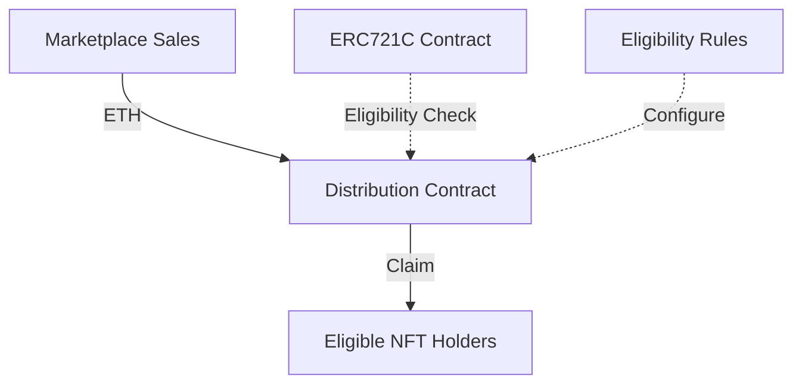
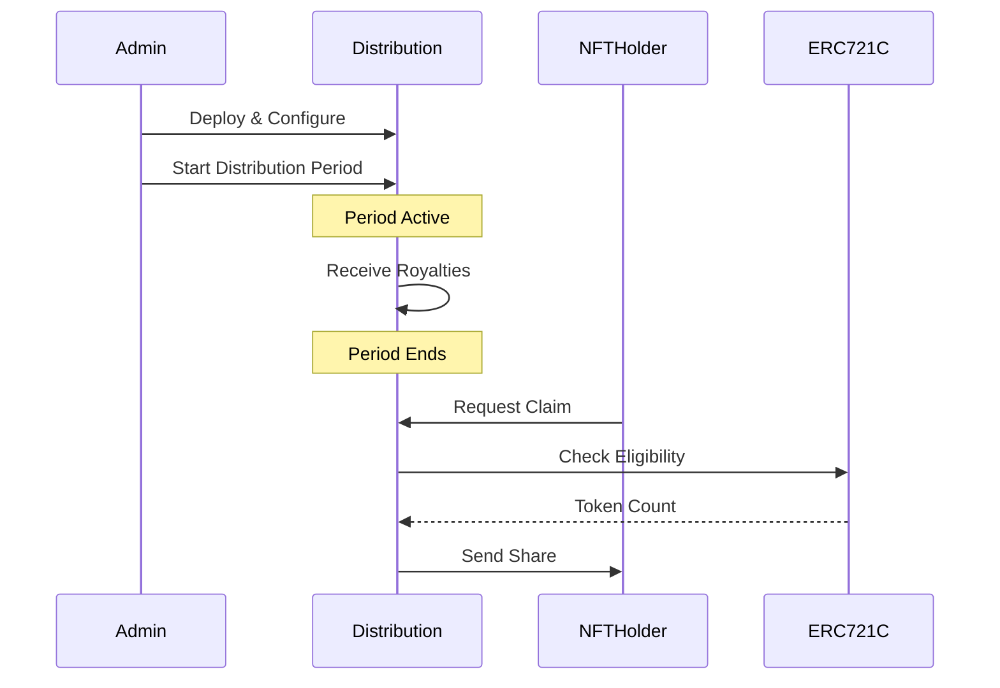
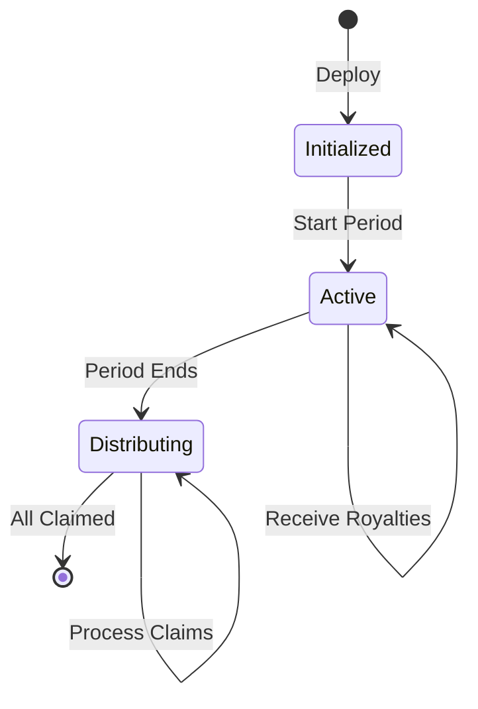
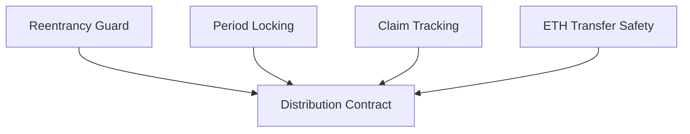

# ERC721C Royalty Pot Distribution

A flexible and secure system for distributing royalties to NFT holders with configurable eligibility criteria and distribution periods.

> **Note**: This is an extension to the ERC721C token standard. For complete documentation of ERC721C, visit [Creator Token Standards](https://github.com/limitbreakinc/creator-token-standards)

## Author
Diluk Angelo (dilukangelo@gmail.com)

## Overview

The Royalty Pot Distribution system enables NFT projects to automatically distribute royalties to token holders based on configurable eligibility criteria. It supports:



## Features

### Distribution Workflow



### Key Components
- Multiple distribution periods
- Custom eligibility rules
- Efficient token-based distribution
- Secure claim mechanisms
- Integration with ERC721C standard

## Installation

```bash
forge install creator-token-standards-royalty-pot-distribution
```

## Usage

### 1. Deploy Distribution Contract

```solidity
// Deploy with your ERC721C contract address
ERC721RoyaltyPotDistribution distribution = new ERC721RoyaltyPotDistribution(
    address(yourERC721C),
    30 days // distribution period
);
```

### 2. Set Eligibility Criteria

```solidity
// Use default NFT holder eligibility
NFTHolderEligibilityCheck eligibility = new NFTHolderEligibilityCheck(
    1 // minimum tokens required
);

// Add eligible collections
eligibility.addEligibleCollection(address(yourERC721C));

// Set eligibility implementation
distribution.setEligibilityImplementation(address(eligibility));
```

### 3. Start Distribution Period

```solidity
// Start new distribution period
uint256 distributionId = distribution.startNewDistribution();
```

### 4. Send Royalties

```solidity
// Send ETH to distribution contract
(bool sent,) = address(distribution).call{value: amount}("");
require(sent, "Failed to send ETH");
```

### 5. Users Claim Distribution

```solidity
// Users can claim their share after period ends
distribution.claimDistribution(distributionId);
```

## Advanced Configuration

### Distribution States



### Custom Eligibility Rules

Create your own eligibility checker by implementing `IEligibilityCheck`:

```solidity
contract CustomEligibilityCheck is IEligibilityCheck {
    function isEligible(address user) external view returns (bool) {
        // Your custom eligibility logic
        return true;
    }
}
```

### Distribution Period Management

```solidity
// Change period length
distribution.setDistributionPeriod(60 days);

// Lock period length
distribution.lockDistributionPeriod();
```

### Query Distribution Info

```solidity
// Get distribution details
Distribution memory info = distribution.getDistributionInfo(distributionId);

// Check user claims
UserClaim memory claim = distribution.getUserClaimInfo(user, distributionId);
```

## Security Considerations



1. **Reentrancy Protection**: All distribution functions are protected against reentrancy attacks.
2. **Period Locking**: Distribution periods can be locked to prevent unauthorized changes.
3. **Double-Claim Prevention**: Claims can only be made once per period per user.
4. **ETH Handling**: Uses secure transfer methods with proper error handling.

## Events

Monitor distribution activities using these events:

```solidity
event DistributionStarted(uint256 indexed distributionId, uint256 startTime, uint256 endTime);
event DistributionClaimed(address indexed user, uint256 indexed distributionId, uint256 amount);
event DistributionPeriodSet(uint256 newPeriod);
event DistributionPeriodLocked();
event EligibilityImplementationSet(address implementation);
```

## Error Handling

The contract uses custom errors for better gas efficiency:

```solidity
error BalanceCheckFailed();
error SupplyCheckFailed();
error NoTokensMinted();
error TransferFailed();
```

## Integration Example

Here's a complete example of integrating with an ERC721C contract:

```solidity
// Deploy ERC721C contract
YourERC721C nft = new YourERC721C();

// Deploy distribution contract
ERC721RoyaltyPotDistribution distribution = new ERC721RoyaltyPotDistribution(
    address(nft),
    30 days
);

// Setup eligibility
NFTHolderEligibilityCheck eligibility = new NFTHolderEligibilityCheck(1);
eligibility.addEligibleCollection(address(nft));
distribution.setEligibilityImplementation(address(eligibility));

// Start distribution period
uint256 distributionId = distribution.startNewDistribution();

// Send royalties (e.g., from marketplace sales)
payable(address(distribution)).transfer(1 ether);

// Users can claim after period ends
// Wait for period to end...
distribution.claimDistribution(distributionId);
```

## Testing

Run the test suite:

```bash
forge test --match-path test/RoyaltyPotDistribution.t.sol -vvv
```

### Coverage
```
Core Contract: 100% line coverage
Eligibility Contracts: 100% line coverage
Integration Tests: Full workflow coverage
```

## Gas Optimization

Key optimizations implemented:
- Custom errors instead of revert strings
- Minimal storage usage
- Efficient token counting
- Optimized eligibility checks

## Contributing

Contributions are welcome! Please check our contribution guidelines before submitting PRs.

## License

MIT License. See LICENSE file for details.
