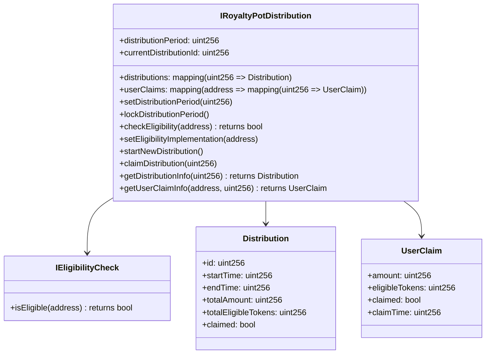

# Royalty Pot Distribution Design

## Overview
This document outlines the design for adding royalty pot distribution functionality to the creator token standards. This feature allows NFT holders to claim their share of royalties based on their token holdings during distribution periods.

## Core Components



## Main Components

### 1. Distribution Period Management
- Configurable distribution period length (e.g. 30 days)
- Admin can modify period until locked
- One-time locking function for period length
- Automatic tracking of periods and IDs

### 2. Eligibility System
- Pluggable interface for custom eligibility logic
- Flexible implementation for different requirements
- Can be updated by admin
- Default implementation (always eligible)

### 3. Distribution Tracking
- Unique incrementing IDs for each distribution
- Records total amount and eligible tokens
- Tracks timeframe and status
- Historical data maintained

### 4. User Claims
- Per-user per-distribution claim tracking
- Historical record of claims
- Amount and eligibility tracking
- Claim timestamps stored

## Data Structures

### Distribution
```solidity
struct Distribution {
    uint256 id;
    uint256 startTime;
    uint256 endTime;
    uint256 totalAmount;
    uint256 totalEligibleTokens;
    bool claimed;
}
```

### User Claim
```solidity
struct UserClaim {
    uint256 amount;
    uint256 eligibleTokens;
    bool claimed;
    uint256 claimTime;
}
```

## Events

```solidity
event DistributionPeriodSet(uint256 newPeriod);
event DistributionPeriodLocked();
event EligibilityImplementationSet(address implementation);
event DistributionStarted(uint256 indexed distributionId, uint256 startTime, uint256 endTime);
event DistributionClaimed(address indexed user, uint256 indexed distributionId, uint256 amount);
```

## Implementation Plan

1. Create new directory structure:
```
src/programmable-royalties/distribution/
├── IRoyaltyPotDistribution.sol
├── RoyaltyPotDistribution.sol
├── eligibility/
│   ├── IEligibilityCheck.sol
│   └── implementations/
```

2. Implement core contracts:
- Base RoyaltyPotDistribution contract
- Eligibility interfaces and implementations
- Integration with existing royalty system

3. Write comprehensive tests covering:
- Distribution period management
- Eligibility checks
- Distribution tracking
- Claim process
- Edge cases and security considerations

4. Update existing contracts to support the new feature

## Security Considerations

- Reentrancy protection for claims
- Access control for admin functions
- Distribution period validation
- Gas limits for bulk operations
- Integer overflow protection
- Eligibility implementation validation